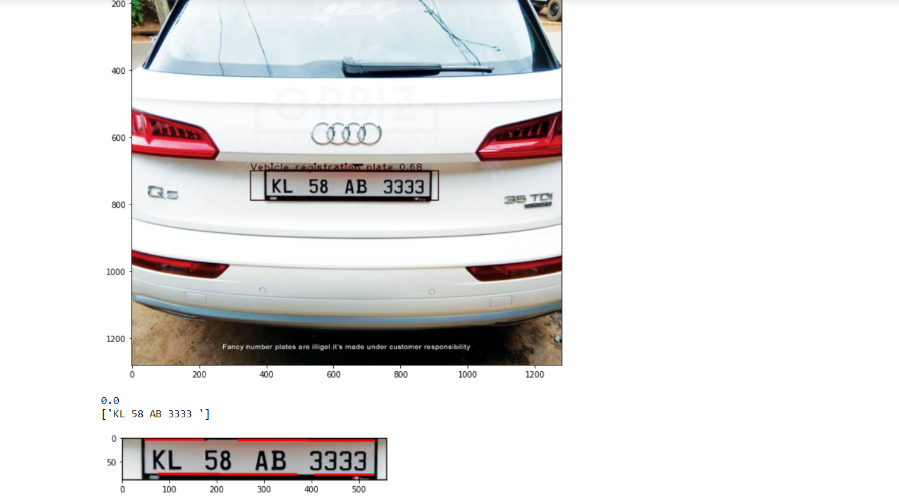

# vehicle-number-plate-detection-and-recognition
vehicle number plate detection using custom trained yolov4 algorithm and recognition using tesseract and easyocr.

## necessary files

#### [Python notebook for train yolov4 algorithm to detect Vehicle registration plate.](https://nbviewer.jupyter.org/github/atultyagi612/vehicle-number-plate-detection-and-recognition/blob/main/Train_YOLOv4_Object_Detector_on_custom_data%20%282%29.ipynb)

#### [Python notebook for detect and recognise vehicle registration plate](https://nbviewer.jupyter.org/github/atultyagi612/vehicle-number-plate-detection-and-recognition/blob/main/vehicle%20plate%20detection%20and%20recognition.ipynb)

#### [Download all trained weights](https://drive.google.com/file/d/1Ha5IflUJG1HHCA6CUhswg8Tvisgvz80k/view?usp=sharing)

#### [Download last trained weights](https://drive.google.com/file/d/1aA1P4R_my226OpVsiwObU9U-w9gsFdEb/view?usp=sharing)

#### [Download configuration file](yolov4_train.cfg)

#### [Python notebook of object detection on custom trained weights](https://nbviewer.jupyter.org/github/atultyagi612/Train-YOLOv4-Object-Detector-on-custom-data/blob/main/object_detection_using_yolov4%20on%20custom%20weights/object_detection_using_yolo.ipynb)

#### [Yolov4 folder for refrence](https://drive.google.com/file/d/1AD_jvtYf063YH9kJXTqFZZEBgpmYeAl_/view?usp=sharing)

